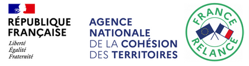
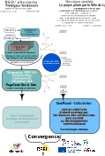

# Ecole Entreprise GaïaMundi

<figure><figcaption></figcaption></figure>

**L’École Entreprise GaïaMundi** a été crée par **CEFI-Formation** individualisée, **Altercarto** et la **Ville de Lyon** dans le cadre d'un appel à projet de l'**ANCT Agence Nationale de Cohésion des Territoire** porteuse d'un volet du "Plan de France Relance" 2021-22, incitant les collectivités locales à proposer des logiciels et applications en Licence Libre, utiles à leur administration et/ou aux citoyens.

La Ville de Lyon, qui utilise depuis plusieurs années[ la suite d'applications de cartographie statistique de la famille GaïaMundi développée par altercarto (http://suitecairo.fr) ](http://188.165.251.203/cairo/), a porté le projet en coopération avec CEFI-Formation ; et Altercarto qui a développé jusqu'ici les versions prototypes .



Le projet comporte trois composantes principales :

1. La réalisation d'une mission de reverse ingénierie visant :&#x20;
   * à décrypter les codes des différents prototypes GaïaMundi, en analyser les fonctionnalités et réaliser une maquette fonctionnelle sous une nouvelle technologie (Node.js pour la version Web avec Electron.js pour la version Poste de travail (installée sur ordinateur pouvant fonctionner hors Internet).
   * La réalisation d'une version distribuable d'un site de publication des travaux de cartographie statistique par les collectivités, en s'appuyant au départ sur l'expérience de la ville de Lyon avec sont site [http://vlko.org ](http://vlko.org)
   * Cette mission a été confiée à l'entreprise CGI, agréée par l'UGAP comme prestataire direct des collectivité
2. La reprise des éléments ainsi réalisés par une équipe de jeunes en contrat de professionnalisation, pour finaliser la version distribuable, encadrés par les partenaires altercarto et Cefi, un chef de projet informatique et d'autres intervenants selon le [Canevas de formation présenté ici](http://213.251.176.22/gaiamundi-dev/proto/s/site0/index0.html#art\_C2-Canevas@@de@@formation). C'est cette composante qui donne naissance à l'Ecole Entreprise GaïaMundi. La finalité première de l'Ecole Entreprise est de finaliser la version distribuable. Mais elle a surtout pour vocation de continuer, comme espace de formation de jeunes en cours d'activité effective, en assurant sa distribution et son perfectionnement, et en proposant dès le début :
3. L'ouverture du projet à une communauté de développeurs La participation des utilisateurs à la gestion du projet (collèges et espace communautaire) Des services mutualisés de formation et de management de données partagées, proposés aux utilisateurs : les collectivités en particulier L'animation de "Groupes d'Impact" rassemblant des collectivités déjà utilisatrices ou interressées pour explorer les possibilités qu'offrent les outils et méthodes GaïaMundi. Ces "Groupes d'Impact" ayant tout autant vocation à témoigner de l'expérience carto avec les outils et la logique GaïaMundi, qu'à entrainer d'autres collectivités et à participer à la définition des besoins de services mutualisés ou individualisés que proposera l'Ecole Entreprise GaïaMundi (les "Groupes d'Impact" sont animés par l'équipe porteuse de la ville de Lyon [(exemple)](http://www.gaiamundi-fabrique.org/site0/index0.html#art\_C2-Seance@@1@@bassin@@lyonnais) .

<figure><figcaption>
Schéma de la "convergence GaïaMundi" Entre <a href="http://suitecairo.fr/">les versions prototypes de GaïaMundi et outils connexes rassemblés sous le nom de package SuiteCairo, réalisées auparavant par altercarto</a> et la version distribuable construite de l'appel à projet ANCT porté par Ville de Lyon avec CEFI et altercarto
</figcaption></figure>

**Exemple de cartographie de données avec la version prototype d'altercarto**&#x20;

La version prototype "SuiteCairo Géo & Stat" d'altercarto sert de support à la formation en attendant l'édition de la première maquette présentable de Gaiamundi

Carte : Indice de vulnérabilité et de pauvreté multidimentionnelles dans les pays du Monde(ONU 2007-2017)

<figure><figcaption></figcaption></figure>
