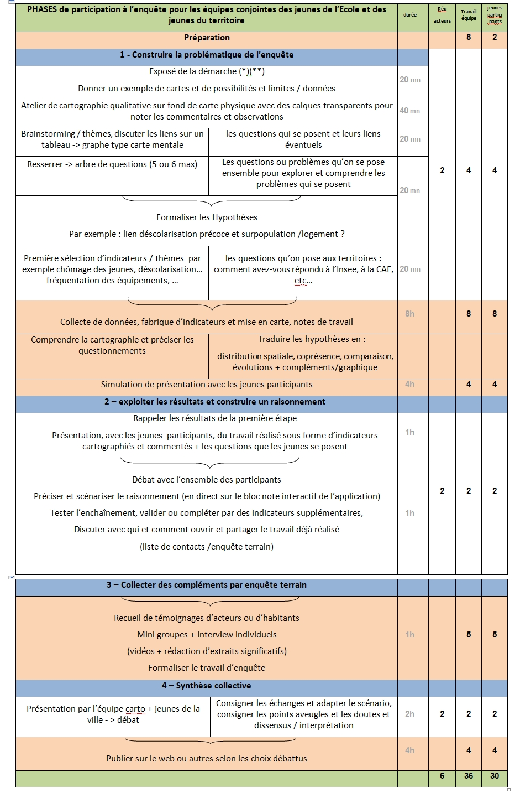
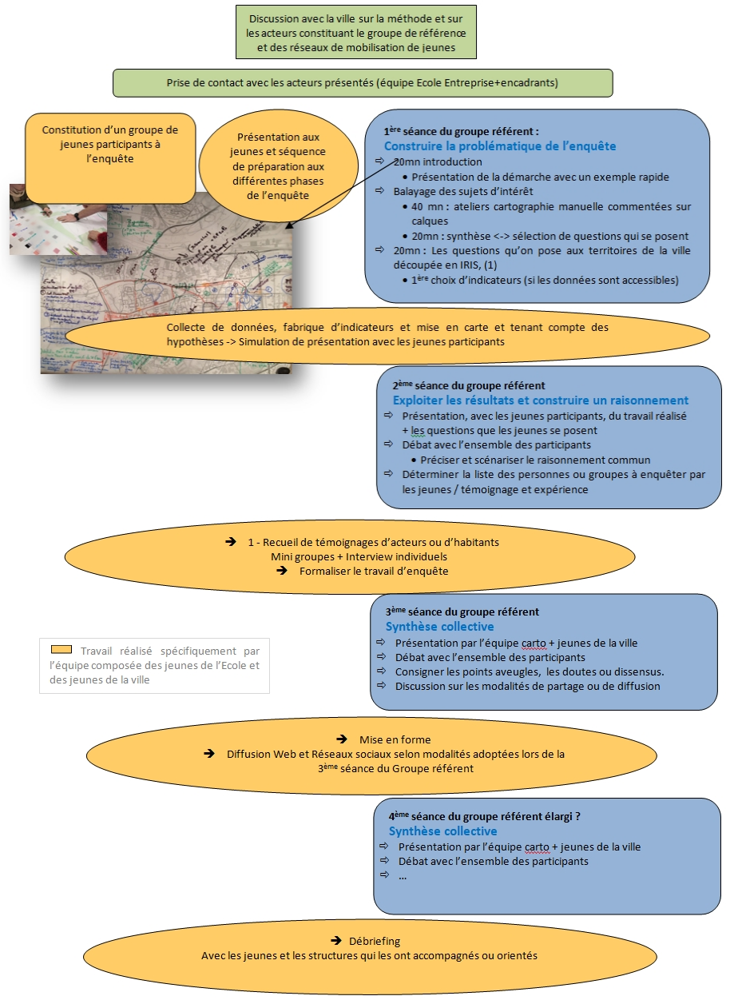
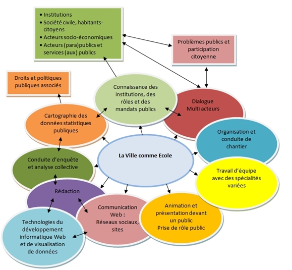

# Démarche pédagogique

## Vocations de l'Ecole Entreprise

**Former en construisant le projet durable de l’Ecole-Entreprise GaïaMundi**

Depuis presque 20 ans, altercarto a développé, en mode R\&D, [une famille d’outils et de méthodes de cartographie statistique interactive, et de gestion de partage de données, dénommée GaïaMundi.](http://91.121.3.209/altercartonew/site0/index0.html#art\_C8-Labo@@RetD) (Voir aussi [SuiteCairo.fr](http://suitecairo.fr)).

Sous forme de prototypes en licence libre GNU GPL, ces outils et méthodes ont été utilisés dans différents contextes institutionnels ou d’initiatives citoyennes , permettant d’accumuler de solides retours d’expériences quant aux fonctionnalités et aux usages.

En 2020, altercarto et son partenaire, la Ville de Lyon – qui utilise ces outils depuis 2009 ([https://vlko.org](https://vlko.org)) –, ont amorcé une démarche visant à passer du prototype à une version stabilisée distribuable, gratuite, en licence libre, et ouverte dès le départ à une communauté de contributeurs indépendants afin d’assurer son développement – via la mise en place d’une plateforme communautaire.

Courant 2022, après un ralentissement relatif lié à la crise Covid, les trois partenaires altercarto, Ville de Lyon et CEFI-Formation, avec l’appui de l’Agence nationale de la cohésion des territoires (ANCT), ont engagé ce processus dans le cadre du plan « France Relance ».

Pour réaliser cette étape cruciale, nous avons élaboré et mis en œuvre le projet de l' « Ecole-Entreprise GaïaMundi », portée conjointement par les trois partenaires. Opérationnelle depuis le 15 novembre 2022, l'Ecole-Entreprise a pour vocation de conduire la réalisation d’une version stabilisée distribuable du logiciel GaïaMundi d'ici fin mai 2023.

L’Ecole-Entreprise GaïaMundi s'inscrit dans la filiation de démarches d'insertion de jeunes en rupture de parcours, en les impliquant dans le développement de technologies avancées et socialement utiles. Quatre jeunes personnes ont, pour cela, été recrutées en contrat de professionnalisation « expérimental » de 6 mois (de novembre 2022 à mai 2023), en partenariat avec AKTO.

L’objectif de l’École-entreprise ne se limite cependant pas aux six mois couverts par cette première phase. Il s’agit, en effet, de s’appuyer sur ces six premiers mois pour réussir la finalisation et le lancement de la distribution du logiciel, mais aussi d’assurer les conditions de pérennisation de l’Ecole-Entreprise en maintenant les emplois créés, en vue de poursuivre le développement logiciel, ainsi que la formation et les services mutualisés mis à disposition de ses utilisateurs.

Il s’agit, en particulier, de proposer la mutualisation des grands jeux de données géographiques et statistiques publiques via des technologies de recherche, de partage et d’intégration facilitée dans les cartes des utilisateurs. Le principe de mutualisation reposant sur des cotisations proportionnées aux capacités budgétaires des utilisateurs qui peuvent être aussi bien :

* des collectivités locales,
* des acteurs de la société civile soucieux de promouvoir l'expertise citoyenne de politiques publiques à forte incidence territoriale,
* des étudiants et chercheurs,
* des associations ou collectifs,
* des bureaux d’étude et d’expertise,
* des entreprises et administrations,
* des utilisateurs individuels. La vocation de l’Ecole-Entreprise GaïaMundi comporte dès lors plusieurs dimensions explicitées ci-après qui seront élaborées durant les six premiers mois : 1 - La conception, la réalisation et le partage de GaïaMundi 2 - La Mutualisation de jeux de données 3 – La conduite "d'enquêtes collaboratives" utiles au dialogue social territorial, 4 - La formation de jeunes en parcours d’insertion et d’orientation 5 - La formation des utilisateurs

### Vocation 1 – La conception, la réalisation et le partage de GaïaMundi, application de cartographie de données statistiques en licence Libre, en version web et bureau

* Le développement et le perfectionnement de l’application GaïaMundi
* Sa promotion et sa distribution
* L'animation de la communauté de développeurs contributeurs
* L’animation de la communauté des utilisateurs

### Vocation 2 – La mutualisation de jeux de données

Il s'agit de mutualiser de vastes jeux de données en réalisant le travail de collecte, de normalisation et contrôle, et en proposant un puissant dispositif en ligne de sélection et d'incorporation directe des données dans les applications de cartographie des utilisateurs. Les prototypes que nous utilisons depuis plusieurs années ont montré le gain considérable de temps pour les utilisateurs et la fiabilité qu'apporte cette mutualisation en amont.\

> _Un exemple courant est celui du recensement annuel édité par l’Insee. Télécharger les données et les mettre en forme pour les intégrer aux cartes représente un travail long et fastidieux que chaque utilisateur doit réaliser, alors que cette fonction pourrait être mutualisée via un dispositif partagé  permettant la sélection des données utiles et leur téléchargement direct dans les applications de cartographie – comme le permet déjà l’application la « Rose des vents » déjà intégrée aux prototypes de GaïaMundi et qu’il s’agit dès lors de perfectionner et stabiliser ._

### Vocation 3 – La conduite « d'enquêtes collaboratives » utiles au dialogue social territorial, mobilisant des collectifs variés, des collectivités publiques et comprenant des phases de restitution et/ou de délibération ouvertes.

L’Ecole-Entreprise GaïaMundi, avec l’appui d’altercarto, propose ce type de démarche :

* aux collectivités locales et plus généralement aux acteurs des politiques publiques à forte incidence territoriale,
* aux organisations de la société civile impliquées dans des démarches de dialogue social territorial Voir fiche Enquête

### Vocation 4 – La formation en alternance de jeunes en parcours d’insertion

Il s’agit de proposer, en partenariat avec CEFI-Formation et d’autres structures de formation, des parcours ou des modules sur les principaux domaines techniques ou de connaissance ou de pratique suivants :

* le développement informatique de l’application de cartographie et des outils gestion de données associés à l’application (différentes formes de représentation des données statistiques publiques quantitatives et outils de commentaire)
* le déploiement (communication web, relation aux utilisateurs…)
* les fondamentaux nécessaires à l’usage raisonné des outils de la famille GaïaMundi (connaissance des données publiques, bases théoriques et pratiques de la cartographie de données statistiques sous forme de « rapprochement de données », sémiologie…)
* la production de manuels d’usage et de documentations scientifique et technique sur les fondements de l’application et ses domaines d’usage appropriés
* l’apprentissage et la pratique des outils cartographiques libres (Umap, OpenStreetMap, QGIS, GaïaMundi…) à différents niveaux d’usage (découverte, débutant, jusqu’à avancé),
* la rédaction et la communication web sur les contenus produits à l’aide de la cartographie de données statistiques publiques
* l’animation de groupes de travail pluri-acteurs avec la médiation d’outils sociotechniques permettant à la fois l’analyse collaborative, l’enregistrement et le partage des échanges
* la conduite d’enquête collaborative avec la médiation de ces outils de cartographie

La démarche pédagogique de l’Ecole-Entreprise GaiaMundi conjugue trois approches : La formation en cours d’activité sous forme de contrat en alternance (que ce soit sur les activités de développement, de distribution ou d’usage des outils de cartographie et de partage de données) et l’accueil de stagiaires en cours d’étude, notamment en licence pro et master.

Voir la fiche Formation en alternance

La pratique en situation réelle à travers la la pratique du développement informatique et aussi la participation aux chantiers d’enquête. Cette pratique joue un rôle déterminant dans la formation mais aussi dans la consolidation du projet d’emploi dans l’Ecole-Entreprise en ce sens qu’elle permet non seulement de consolider un parcours de développeur.se, mais aussi de construire une capacité à accompagner les utilisateurs tels que les collectivités, notamment dans l’utilisation de la cartographie statistique comme outils facilitateur du dialogue social territorial

(voir-ci après)

L’orientation et le positionnement dans les différents domaines de connaissances, de métier et de pratiques couverts par le développement ou l’usage des outils de la famille GaiaMundi. Voir la fiche Orientation et Positionnement.

### Vocation 5 – La formation des utilisateurs de l’application GaïaMundi

* Modules de formation en collectif
* Sessions en ligne,
* Production des manuels et supports méthodologiques
* Assistance en ligne
* Accompagnement-conseil pour la réalisation de chantiers Fiches détaillées

[Canevas de formation ](http://213.251.176.22/gaiamundi-dev/proto/s/site0/index0.html#art\_C2-Canevas@@de@@formation)

[Fiche Enquête de terrain](http://213.251.176.22/gaiamundi-dev/proto/s/site0/index0.html#art\_C2-Chantiers@@denquete@@carto)

[Fiche l'enquête comme outil d'Orientation](http://213.251.176.22/gaiamundi-dev/proto/s/site0/index0.html#art\_C2-Lenquete@@comme@@outil@@dorientation)

## Canevas de formation

**Former l'équipe en contrats de professionnalisation en réalisant le chantier de développement (nov 22 à mai 23)**

Les différents modules sont abordés sous forme de cours associés à des travaux dirigés. Ces TD sont d'abord composés d'exercices liés aux cours, ensuite appliqués : lors de la rédaction des Manuels d'utilisation, lors du développement des composants de l'application, lors des chantiers (enquêtes de terrain et réalisation de modules de cartographie statistique pour des partenaires), puis pour ce qui concerne la communication et la rédaction, dans la seconde moitié du cursus et ensuite dans la phase de distribution et d'animation des premières communautés d'utilisateurs et de développeurs.

<figure><figcaption></figcaption></figure>

<figure><figcaption></figcaption></figure>

<figure><figcaption></figcaption></figure>

A ces modules s’ajoute, au cours des six mois, là aussi dans une logique de formation en cours d’action, un processus de travail collectif, accompagné par un consultant, incluant l’équipe des salariés en contrat de professionnalisation, et les représentants des partenaires dans le projet, pour élaborer le modèle économique et social de l’Ecole-Entreprise GaïaMundi et la forme qu’elle devra prendre pour remplir ses missions.

Il s’agit notamment de concrétiser la responsabilisation des futurs salariés dans sa gouvernance, laquelle devra s’ouvrir aux utilisateurs, à la communauté des développeurs et aux partenaires actuels ou à venir, incluant l’économie des services communs basés sur un système de cotisations reposant sur des principes mutualistes.

## Chantiers d'enquête carto

**La cartographie de données statistiques publiques au service du dialogue social territorial**

Afin de promouvoir l’une des vocations principales de l’application et de la démarche GaïaMundi, à savoir l’usage de la cartographie comme outil de dialogue social territorial, et afin de répondre aux besoins d’acteurs locaux, des enquêtes de terrain seront mises en œuvre au cours du cursus de formation dans l’Ecole-Entreprise GaïaMundi en partenariat avec : • des collectivités locales et des acteurs des politiques publiques à forte incidence territoriale, • des organisations de la société civile soucieuses d’implication dans des démarches de dialogue social territorial. Les enquêtes seront réalisées :

* soit par l’équipe de jeunes en formation dans l’Ecole-Entreprise GaïMundi seule(une équipe de 4)
* soit en associant à cette démarche, des jeunes des territoires enquêtés.

Différents publics peuvent être concernés par cette seconde option :

• des jeunes fréquentant les dispositifs publics, les missions locales (par exemple via le dispositif contrat engagement jeunes),&#x20;

• des jeunes impliqués dans des activités ou engagements collectifs,&#x20;

• des jeunes fréquentant des associations ou des équipements du territoire communal (MJC, centre social…). La démarche d'enquête se déroule en différentes phases, dont seulement une partie concerne les jeunes des territoires enquêtés. Dans certains cas, il est néanmoins possible de réaliser l’ensemble avec eux.

La mise en œuvre des enquêtes se fera au cours des six premier mois.

Deux voire trois de ces enquêtes seront réalisées dans des collectivités de la région lyonnaise au cours de cette période. Cela dans le double but de bien former cette jeune équipe mais aussi de valoriser ensuite ces démarches à visée « participative » auprès d'autres collectivités et associations.

Voir ci-après les descriptifs schématique et détaillé des démarches d’enquête proposées.

<figure><figcaption></figcaption></figure>

Détail des étapes et évaluation du temps mobilisé pour les participants (Equipe GaïaMundi, jeunes de la ville, groupe référent)

<figure><figcaption></figcaption></figure>

## L'enquete comme outil d'orientation

**La cartographie et l'enquête collective, révèlatrices de domaines d'intérêt ou de positionnement.**

La méthode pédagogique proposée pour faire de l’enquête de terrain un support d'orientation s’inspire de la méthode de l’objet technique \[1].

Aux différentes étapes de l’enquête et des activités qu’elle implique, les jeunes participants sont conduits à explorer, découvrir ou tenir compte d’un ensemble de domaines désignés dans le schéma suivant.

<figure><figcaption>
domaines d'intérêt mobilisés par l'activité d'enquête cartoraphique
</figcaption></figure>

Aux différentes étapes de l’enquête et des activités qu’elle implique, les jeunes participants sont conduits à explorer, découvrir ou tenir compte d’un ensemble de domaines désignés dans le schéma suivant.

L’enquête territoriale, basée sur la cartographie de données statistiques publiques et impliquant différents types d’acteurs, articule ainsi des domaines de connaissance et d’activité qui peuvent venir confirmer le caractère concret de domaines d’intérêts, les révéler ou au contraire conforter d’autres choix. Ou bien d’autres façons de les aborder, en particulier par le travail collectif, permettant de dépasser les appréhensions ou les limites liées à des parcours de formation éloignés ou non aboutis.

Un propriété de cette démarche est qu’elle propose une articulation simple entre des domaines d’étude et de professionnalisation possibles et/ou d’investissement citoyen dans des sujets d’utilité collective.

Mise en œuvre du schéma d’enquête comme outil d’orientation active Cette démarche d’orientation et/ou de positionnement via la médiation d’un objet sociotechnique conjugue : • l’exploration de différents domaines de formation et de professionnalité impliqués dans la conduite de l’enquête, • la confrontation croisée des expériences des jeunes participants selon une méthode inspirée de la « méthode de l’objet technique » consistant à réunir un groupe (ici les jeunes) autour d’un objet sociotechnique (la cartographie comme outil de partage de connaissance sur le monde commun) et en les invitant à en découvrir, par un travail collectif accompagné : les lois de son fonctionnement technique (l’application, les données , les cartes) et social (la carte comme rassembleur d’acteurs de différents types), les deux aspects techniques et social étant indissociables dans ce type de démarche d’enquête. Le collectif participant dispose pour cela de trois types de ressources :&#x20;

• Le collectif de participants. Celui-ci doit pour cela s’auto-organiser pour réussir le parcours d’enquête en ne laissant personne sur le bas coté. ^

• Une documentation technique et des experts auxquels ils peuvent s’adresser.&#x20;

• Un•e observateur.•trice ou de préférence un duo \[2] analysant le fonctionnement du groupe (les observateurs n’interviennent en principe dans le cours de l’action que lorsque le groupe le demande, sollicite un retour sur son fonctionnement et ou suggère ce qui peut être facilitant) et proposant aux jeunes des entretiens individualisés, en cours d’action si nécessaire, et en tout cas en fin de cycle, pour travailler sur l’orientation voire une démarche de positionnement.&#x20;

L’intérêt d’une telle démarche n’est pas seulement son effet individuel de découverte d’un domaine d’activité ou d’un champ pratique motivant et en phase avec sa propre perception de son aptitude à s’y orienter.

L'intérêt est de cette démarche est aussi de mettre en mouvement et en lumière la capacité des jeunes à prendre place dans un collectif en y contribuant et en y puisant aussi des ressources, savoirs et savoir-faire dont ils ont besoin pour prendre part à la réussite du projet sans pour autant être déjà expérimentés dans le domaine.

L’une des conditions de réussite de cet engagement dans l’action collective tient au fait que même si les lois qui régissent les outils utilisés peuvent apparaître complexes, l’objet doit présenter un degré élevé de familiarité pour les participants. Dans le cas présent, la source de familiarité est celle du territoire d’habitat et de vie quotidienne ainsi que les problématiques abordées qui sont partagées directement ou indirectement par les jeunes participants bien qu’étant ici appréhendées par la médiation d’un outil technique plus ou moins étranger.

C’est précisément cet outil, ses composantes et ses lois de fonctionnement, qu’il s’agit justement d’appréhender à travers ses usages concrets et de saisir les articulations qu’il permet entre différents domaines d’intérêt.

\_\_\_\_\_\_\_\_\_\_\_\_\_\_\_\_\_\_\_\_\_\_\_\_\_\_\_\_\_

\[_1]« Il s’agit dès lors de partir du prétexte de la technologie et de ses usages pour mettre en débat le travail : celui que l’on fait ou que l’on souhaiterait faire (avec ou sans les dispositifs d’ailleurs), celui aussi que l’on fait mal ou que l’on arrive plus à faire (du fait de ces nouveaux outils). En d’autres termes, s’il faut partir de l’activité pour penser la technologie, on peut aussi partir de la technologie pour « repenser » (et également « repanser », au sens de corriger) le travail. Et en rendant possible la création de cet espace de délibération autour des TIC, l’ambition est aussi de se dégager d’une logique d’individualisation des difficultés et des failles du travail. L’intérêt est alors que « le débat social ne porte pas directement sur des questions de personnalités, mais sur des questions qui dépassent le niveau individuel, sur des questions d’organisation du travail. » (Davezies, 2005, p. 25). « La méthode de l’objet technique paraît à cet égard particulièrement pertinente pour conduire ce processus d’élaboration collective. Rappelons que cette démarche est issue des principes de la pédagogique active et inductive et a été développée dans le champ de la formation des adultes par Marcon, en reprenant des éléments de l’objet technique de Simondon. Il a pour but, à partir de la présentation et de la description d’objets familiers, riches, emblématiques voire problématiques de la situation professionnelle de mettre le métier en débat par un collectif de travail. Ces objets peuvent être tangibles comme des artefacts techniques, des instruments, des supports de travail. Mais ils peuvent être aussi de nature intangible comme des processus, des règles, des procédures, des pratiques collectives instituées. Il s’agit, au travers de ces discussions sur ces artefacts et sur le travail, de rendre visible les difficultés de l’activité, mais aussi son inventivité, de rendre lisible les productions, les créations individuelles et collectives et d’organiser de façon dynamique et collective la transmission des savoirs d’expérience. Cette démarche doit ainsi aider à définir les conditions de développement du pouvoir d’agir (Gaubert, 2012) ». Cité par Marc-Eric Bobillier Chaumon et Yves Clot, « Clinique de l’usage : Les artefacts technologiques comme développement de l’activité », Activités, 13-2,2016 \[en ligne]._

_\[2]Une personne de l’équipe EE GaïaMundi et une personne d’une structure d’insertion ou de formation du territoire._

