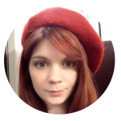
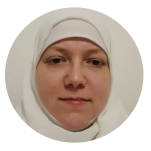
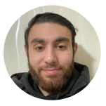
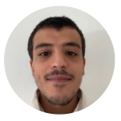
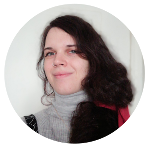
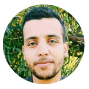
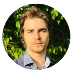
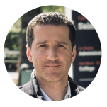
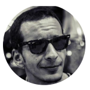

# Equipe

Dans le prolongement de l'histoire de l'application de cartographie statistique GaiaMundi conçue par l'association altercarto (Fr) et utilisée par l'association "Cartographie Citoyenne en Tunisie", nous avons rencontré Mohamed Marrouchi , acteur du logiciel libre au niveau international et dirigeant de l'entreprise Hexastack basée à Tunis. Pressenti comme chef de projet pour le développement de l'application dans le cadre de l’École Entreprise il a propose d'incorporer au projet deux jeunes tunisiens en fin de parcours d'école d'ingénieur informatique dans le cadre de leurs Projets de Fin d’Étude (PFE). Il en résulte une équipe riche et ultra dynamique qui a portée le projet à son terme dans un temps record.

### Equipe de développement en France en contrat de professionalisation

<figure><figcaption>
Ninon Tatu Dév. fullstack orientée Design We0b0
</figcaption></figure>

 

<figure><figcaption>
Noure El Assil  - Développeuse fullstack
</figcaption></figure>

<figure><figcaption>
Andy Matloub Younan Développeur fullstack
</figcaption></figure>

 

<figure><figcaption>
Yassine Tej  - Développeur fullstack
</figcaption></figure>

<figure><figcaption>
Julie Marconnet Université de Saint-Etienne Master II FOULE Enquête et procédure d'accès aux données non ouvertes
</figcaption></figure>

### Equipe de développement en Tunisie portée par l'entreprise Hexastack, en appui à l'équipe française en formation

<figure><figcaption>
Ala Hamadi - Développeur Fullstack (PFE)
</figcaption></figure>

 

<figure><figcaption>
Chedli Elloumi - Développeur Fullstack (PFE)
</figcaption></figure>

### Conduite de projet

<figure><figcaption>
Clément Breysse Consultant et formateur rattaché à CEFI-Formation
</figcaption></figure>

 

<figure><figcaption>
Hervé Paris Animateur de l'Ecole Entreprise GaïaMundi
</figcaption></figure>

 

<figure><figcaption>
Mohamed Marrouchi Ingénier informatique Dirigeant de l'entreprise Hexastack
</figcaption></figure>

